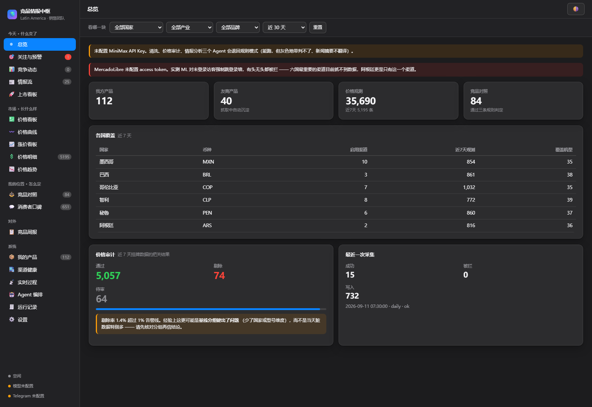
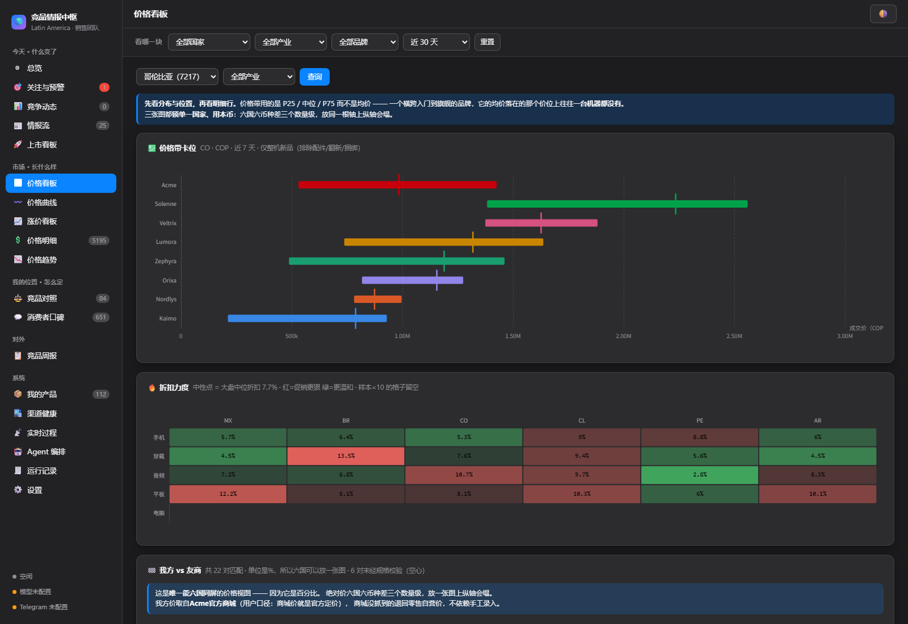
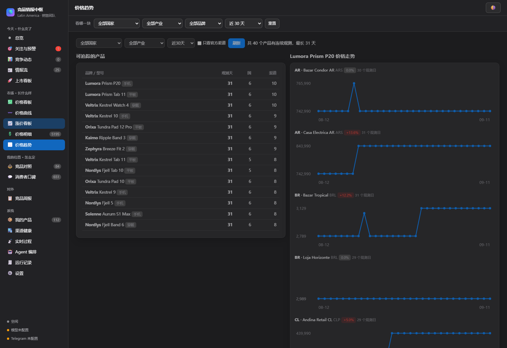
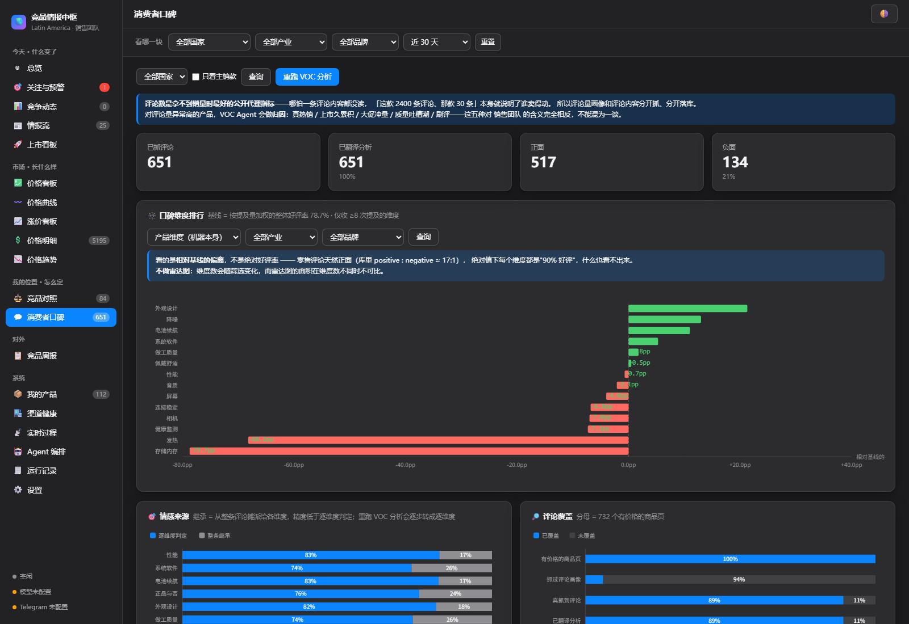

# LatAm Price Intelligence Hub

> **Educational use only.** This project is published for learning and demonstration.
> Commercial use is not permitted; anyone considering commercial use is solely
> responsible for legal and regulatory compliance in every applicable jurisdiction.
> See [LICENSE](LICENSE).

**A resident multi-agent pipeline that turns public retail listings across six countries into a daily competitive briefing.**

Scrape → clean → audit → match → brief, unattended, every day: 22 consumer-electronics brands, ~30 retail channels across Mexico, Brazil, Colombia, Chile, Peru and Argentina, delivered as comparison boards, launch trackers and a Telegram digest.

> Personal project built on personal time and equipment. It observes **publicly visible retail prices only** — no employer code, data or systems. The own brand and every internal product name are replaced by fictional equivalents ("Acme"); the public retailer sites and rival brands the pipeline observes are public information and appear under their own names in the scraping config.

## Why it exists

Channel pricing in Latin America moves daily and differently in every country. Doing this by hand means opening dozens of retailer pages across six countries every morning — so nobody does it consistently, and pricing decisions get made on stale anecdotes. This pipeline made the morning sweep free.

## Architecture

1. **Scheduled scraping layer** — per-country browser workers with resilient selectors and retry budgets; runs as a Windows service, survives reboots.
2. **Multi-agent cleaning & audit** — LLM agents normalize messy listing titles into structured records (brand / model / variant / memory), a separate hygiene pass audits the extraction (`tests/test_llmhygiene.py` guards against prompt-injection from listing text and format drift), and a deterministic model-key matcher (`app/matching/`) reconciles the same product across channels and countries.
3. **Products on top** — price-comparison boards, a launch tracker (new SKUs appearing in any channel), and a daily Telegram briefing.

The interesting engineering is in the boring parts: audit-the-extractor tests, dictionary-guarded matching instead of trusting the LLM, and a config-first design (`config/runtime.example.yaml`) so channels/brands are data, not code.

## Run it

Three commands, no tokens, no scraping — the boards light up with a **synthetic demo dataset**:

```bash
pip install -r requirements.txt     # Python 3.11+ (only the FastAPI/SQLite side is needed for the demo)
python tools/make_demo_db.py        # builds data/intel.db with fictional brands, channels, prices, reviews
python main.py serve                # then open the printed URL, default http://127.0.0.1:8765
```

`make_demo_db.py` also creates `config/runtime.yaml` (from the example, with scheduling / Telegram /
phone sync switched off) and `config/my_products.csv` (from the sample) when they are missing. Use
`--fresh` to rebuild, `--seed N` / `--days N` / `--end YYYY-MM-DD` to vary the dataset, and
`python main.py serve --port 8799` if the default port is taken.

**About the demo data.** Everything the script writes is invented and generated from a fixed seed
(same seed → identical database): six countries, eight fictional brands ("Acme" is the placeholder
own brand; the rivals are made-up names), 40 fictional models, 12 fictional retail channels, ~60 days
of daily price observations with promos, launches and rises, plus the derived price moves, competitor
matches, review aspects, intel feed and a facts-only weekly brief. No real retailer, brand, product,
person or company figure appears in it. The competitor matcher, alert scanner and weekly-report agent
that run on top are the real pipeline code — only the input rows are synthetic.

**Real data (optional).** Live scraping, LLM cleaning and Telegram delivery need your own tokens and a
browser runtime; they are not required for the demo:

```bash
1-install.bat                      # deps + browser runtime + database (Windows)
# fill in tokens on the Settings page, or in config/runtime.yaml
tools\install-service.ps1          # optional: run as a resident service
```

---
*Scraped observation data and browser profiles are not part of this repository.*

## Screenshots

Taken on the synthetic demo dataset (`tools/make_demo_db.py`) — every brand, model, channel and price is invented.

| Overview — coverage, audit gate, last run | Price board — P25/median/P75 bands per brand, discount heat map |
|---|---|
|  |  |

| Price trend — per-channel series with credibility-tiered moves | Voice of customer — aspect sentiment vs. baseline |
|---|---|
|  |  |
